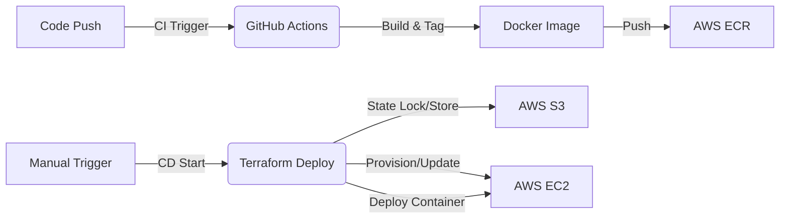

---

# 🌐 Strapi DevOps Tools – Neeraj (Tasks 1–3)

This repository contains a Strapi application.

---

## 📌 Overview of Tasks

| Task       | Goal                                                     |
| ---------- | -------------------------------------------------------- |
| **Task 1** | Basic Strapi setup with a custom content type            |
| **Task 2** | Containerized Strapi using a multi-stage Dockerfile      |
| **Task 3** | Fully Dockerized stack using PostgreSQL + Strapi + Nginx |
| **Task 4** | Docker Hub image storage setup |
| **Task 5** | Infrastructure as Code (Terraform) deployment to AWS |
| **Task 6** | Automated CI/CD Pipeline (GitHub Actions + AWS ECR + S3 Backend) |
| **Task 7** | **Production Deployment** (ECS Fargate, RDS, Application Load Balancer) |
| **Task 8** | **CloudWatch Monitoring** (Dashboards, Alarms, Container Insights) |

---

## 🚀 Task 1 – Strapi Setup (Local Development)

### Work Completed

* Created a new Strapi project using **Quickstart**
* Ran the project using `npm run develop`
* Configured the **Admin Panel**
* Created a custom content type: **`devops-tool`**
* Added sample entry to validate CRUD operations
* Enabled **public permissions** for the API
* Imported project under: `The-Config-Crew/neeraj-strapi-task1`

### Run Locally (Without Docker)

```bash
cd neeraj-strapi-task1
npm install
npm run develop
```

Access:

* Admin Panel → [http://localhost:1337/admin](http://localhost:1337/admin)
* API → [http://localhost:1337/api/devops-tools](http://localhost:1337/api/devops-tools)

---

## 🐳 Task 2 – Containerized Strapi using Multi-Stage Dockerfile

A **multi-stage Dockerfile** was created to build and run Strapi in production mode.

### Build Stage

* Uses base image: `node:20-slim`
* Installs build dependencies (python3, make, g++)
* Runs `npm install`
* Builds Strapi admin UI using `npm run build`
* Reduces final image size using `npm prune --omit=dev`

### Runtime Stage

* Uses `node:20-slim`
* Copies build output from previous stage
* Sets environment variables: `NODE_ENV`, `HOST`, `PORT`
* Exposes port `1337`
* Starts Strapi using `npm run start`

### Build & Run Docker Image

```bash
docker build -t neeraj-strapi-app .
```

```bash
docker run --name neeraj-strapi-container \
  -p 1337:1337 \
  --env-file .env \
  neeraj-strapi-app
```

Stop & remove container:

```bash
docker stop neeraj-strapi-container
docker rm neeraj-strapi-container
```

---

## 🌐 Task 3 – Full Deployment: PostgreSQL + Strapi + Nginx (Docker Compose)

A complete production-style deployment was created using **3 services**:

| Service    | Purpose                     |
| ---------- | --------------------------- |
| PostgreSQL | Database backend for Strapi |
| Strapi     | Headless CMS                |
| Nginx      | Reverse proxy and routing   |

### PostgreSQL Environment

```
POSTGRES_USER=strapi
POSTGRES_PASSWORD=strapi123
POSTGRES_DB=strapidb
```

* Uses persistent volume
* Runs inside the `strapi-net` network

### Strapi Environment

```
DATABASE_CLIENT=postgres
DATABASE_HOST=postgres
DATABASE_PORT=5432
DATABASE_NAME=strapidb
DATABASE_USERNAME=strapi
DATABASE_PASSWORD=strapi123
```

Strapi secrets:

```
APP_KEYS
API_TOKEN_SALT
ADMIN_JWT_SECRET
JWT_SECRET
```

### Nginx Reverse Proxy

* Forwards incoming traffic → Strapi service
* Uses custom config:

```
./nginx/nginx.conf:/etc/nginx/nginx.conf:ro
```

#### nginx.conf Example

```nginx
events {}

http {
  server {
    listen 80;

    location / {
      proxy_pass http://strapi:1337;
      proxy_set_header Host $host;
      proxy_set_header X-Real-IP $remote_addr;
    }
  }
}
```

Traffic flow:

```
User → http://localhost → Nginx → Strapi (1337)
```

### Run Full Docker Stack

```bash
docker compose up --build
```

Access Strapi:
[http://localhost/admin](http://localhost/admin)

Stop stack:

```bash
docker compose down
```

---

---

## 🐋 Task 4 – Docker Hub Image Push

The Strapi Docker image was built and pushed to Docker Hub for deployment on AWS.

### Docker Hub Repository
**Image**: `anirek/strapi-app:latest`

### Build & Push Commands

```bash
# Build the image
docker build -t anirek/strapi-app:latest .

# Login to Docker Hub
docker login

# Push to Docker Hub
docker push anirek/strapi-app:latest
```

### Pull & Run from Docker Hub

```bash
docker pull anirek/strapi-app:latest
docker run -p 1337:1337 \
  -e DATABASE_CLIENT=postgres \
  -e DATABASE_HOST=postgres \
  -e DATABASE_PORT=5432 \
  -e DATABASE_NAME=strapidb \
  -e DATABASE_USERNAME=strapi \
  -e DATABASE_PASSWORD=strapi123 \
  anirek/strapi-app:latest
```

---

## ☁️ Task 5 – AWS Deployment with Terraform

Deployed the Strapi application to AWS EC2 using **Infrastructure as Code (Terraform)** with automated setup via User Data.

### Architecture

```
Internet
   ↓
Security Group (Ports 22, 80, 1337)
   ↓
EC2 Instance (m7i-flex.large, ap-south-1)
   ↓
Docker Engine
   ├─ Strapi Container (anirek/strapi-app:latest)
   └─ PostgreSQL Container (postgres:15)
```

### Infrastructure Components

#### 1. **Variables** (`variables.tf`)
- AWS Region: `ap-south-1` (Mumbai)
- Instance Type: `m7i-flex.large`
- AMI: Ubuntu 22.04 LTS
- Database credentials

#### 2. **Main Infrastructure** (`main.tf`)
- **Security Group**: Allows inbound traffic on ports 22 (SSH), 80 (HTTP), 1337 (Strapi)
- **EC2 Instance**: Ubuntu-based instance with public IP
- **User Data**: Automated installation script

#### 3. **User Data Script** (`install_strapi.sh.tpl`)
Automatically executes on instance boot:
1. Installs Docker using official installation script
2. Creates `docker-compose.yml` dynamically
3. Starts PostgreSQL and Strapi containers
4. Configures internal Docker networking

#### 4. **Outputs** (`outputs.tf`)
- Public IP address
- Strapi URL (http://IP:1337)

### Deployment Commands

```bash
cd task5-terraform

# Initialize Terraform
terraform init

# Preview changes
terraform plan

# Deploy infrastructure
terraform apply -auto-approve

# Get outputs
terraform output

# Destroy infrastructure (cleanup)
terraform destroy -auto-approve
```

### Live Deployment

**URL**: http://52.66.245.244:1337  
**Admin Panel**: http://52.66.245.244:1337/admin

### Key Features

✅ **Infrastructure as Code**: Entire deployment is reproducible  
✅ **Automated Setup**: Zero manual configuration required  
✅ **Docker Compose**: Multi-container orchestration  
✅ **Secure Networking**: Isolated Docker network for DB communication  
✅ **EC2 Instance Connect**: SSH access without key pairs  
✅ **Self-contained Database**: PostgreSQL running in container

### Design Decisions

**Why containerized PostgreSQL instead of AWS RDS?**
- Original plan was to use AWS RDS for managed PostgreSQL
- Due to IAM permission constraints (`iam:CreateServiceLinkedRole`), opted for containerized approach
- For production, RDS would be preferred for managed backups and scaling

**Why EC2 Instance Connect instead of SSH keys?**
- More secure - temporary SSH keys pushed via AWS API
- No need to manage `.pem` files
- Simpler access control

---

## 🚀 Task 6 – Automated CI/CD Pipeline

We implemented a robust **CI/CD Pipeline** using **GitHub Actions** to automate the build, test, and deployment process.

### Architecture



### Components

#### 1. Continuous Integration (CI)
*   **Workflow**: `.github/workflows/ci.yml`
*   **Trigger**: Push to `main` branch.
*   **Actions**:
    *   Authenticates with AWS.
    *   Checks for ECR repository existence.
    *   Builds Docker image from source.
    *   Pushes image to **AWS Elastic Container Registry (ECR)** with git commit SHA tag.

#### 2. Continuous Deployment (CD)
*   **Workflow**: `.github/workflows/terraform.yml`
*   **Trigger**: Manual Workflow Dispatch (for control).
*   **Actions**:
    *   **Terraform Init**: Uses **AWS S3 Backend** (`bucket: neeraj-strapi-task-state`) for remote state management.
    *   **Terraform Apply**: Provisions/Updates EC2 instance and Security Groups.
    *   **SSH Deployment**: Connects to the EC2 instance, connects the app to the `strapi-app_strapi-net` network, and launches the new container.

### Key Improvements
*   **State Persistence**: Moved from local `terraform.tfstate` to **S3 Remote Backend** to allow team collaboration and prevent state loss.
*   **Security**: Used **GitHub Secrets** for AWS Credentials and SSH Keys.
*   **Reliability**: Added check mechanisms for `cloud-init` completion and network existence.
*   **Zero-Downtime-ish**: Rolling updates by pulling new images and restarting containers.

## ☁️ Task 7 – Production Deployment (ECS Fargate + RDS)

Transformed the single-server deployment into a **Scalable, Serverless, Production-Grade** infrastructure.

### Architecture

```mermaid
flowchart TB
    User((User)) -->|HTTPS/80| ALB[Application Load Balancer]
    subgraph VPC [Custom VPC]
        subgraph Public Subnets
            ALB
            ECS[ECS Service (Fargate)]
        end
        subgraph Private Subnets
            RDS[(AWS RDS Postgres)]
        end
    end
    
    ALB -->|Forward 1337| ECS
    ECS -->|Connect 5432| RDS
```

### Components Built (Terraform)
All infrastructure is defined in `task7-ecs/terraform`:

1.  **VPC & Networking** (`networking.tf`):
    *   **High Availability**: 2 Public Subnets (App) + 2 Private Subnets (DB) across 2 Availability Zones.
    *   **Security**: Chained Security Groups (ALB -> ECS -> RDS).
2.  **Database** (`rds.tf`):
    *   **Managed**: AWS RDS PostgreSQL 15.10.
    *   **Secure**: Isolated in private subnets, no public access.
3.  **Compute** (`ecs.tf`):
    *   **Serverless**: ECS Fargate (No EC2 management).
    *   **Auto-Healing**: If the container crashes, ECS replaces it automatically.
4.  **Load Balancer** (`alb.tf`):
    *   Handles traffic distribution and Health Checks.

### Automated CI/CD (`deploy-ecs.yml`)
1.  **Build**: Docker Build -> Push to **ECR**.
2.  **Zero-Downtime Deploy**:
    *   Renders new Task Definition with the new Image ID.
    *    performs a **Rolling Update** of the ECS Service.

### Debugging & Verification
*   **Debug Workflow**: Created `.github/workflows/debug-ecs-logs.yml` to one-click fetch logs from Fargate.
*   **SSL Fix**: Configured `DATABASE_SSL=true` and `rejectUnauthorized=false` to meet RDS security standards.

## 📊 Task 8 – CloudWatch Monitoring & Metrics

Added a layer of **Observability** to the ECS Infrastructure.

### Features Added
1.  **Container Insights**: Enabled on the ECS Cluster to track granular metrics (Task Count, Network I/O, Storage).
2.  **CloudWatch Logs**: Centralized logging group `/ecs/strapi-app`.
3.  **Automated Alarms** (`monitoring.tf`):
    *   🚨 **High CPU**: Triggers if usage > 80%.
    *   🚨 **High Memory**: Triggers if usage > 80%.
4.  **Operational Dashboard**: A "Single Pane of Glass" showing:
    *   Service Health (CPU/RAM).
    *   Live Task Count.
    *   Network Traffic Graphs.

---

## ✔️ Deliverables Summary

| Task   | Deliverable                                                |
| ------ | ---------------------------------------------------------- |
| Task 1 | Working Strapi setup with the `devops-tool` collection     |
| Task 2 | Multi-stage Dockerfile for Strapi                          |
| Task 3 | PostgreSQL + Strapi + Nginx deployed via Docker Compose    |
| Task 4 | Docker image pushed to Docker Hub (`anirek/strapi-app`)    |
| Task 5 | AWS EC2 deployment using Terraform with automated setup    |
| Task 6 | Full CI/CD Pipeline (GitHub Actions, ECR, S3 Backend)      |
| Task 7 | Production ECS Fargate Cluster + RDS + Automated Deploy|

---

## 📂 Project Structure

```
neeraj-strapi-task1/
├── src/                      # Strapi application code
├── config/                   # Strapi configuration
├── task5-terraform/          # EC2 Infrastructure (Legacy)
├── task7-ecs/                # ECS Infrastructure (Production)
│   └── terraform/
│       ├── networking.tf     # VPC, Subnets, SG
│       ├── ecs.tf            # Cluster, Service, Task Def
│       ├── rds.tf            # Database
│       └── alb.tf            # Load Balancer
├── .github/workflows/
│   ├── deploy-ecs.yml        # Task 7 CI/CD
│   └── debug-ecs-logs.yml    # Debugging Tool
└── README.md                 # This file
```

---

## ✨ Author

**Neeraj – DevOps Intern**  
**Organization**: The Config Crew @ Pearl Thoughts

---

